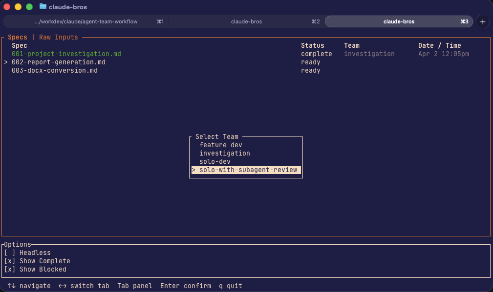
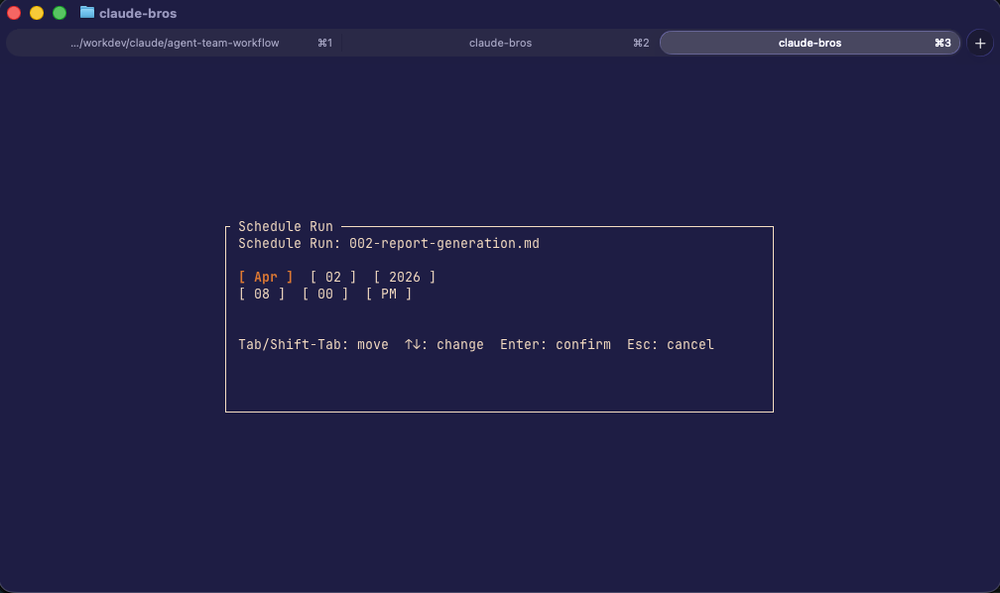
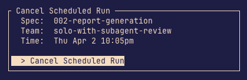

# claude-launch

A TUI launcher and scheduler for autonomous Claude Code agent workflows. Pick a spec, assign a team, and `claude-launch` handles the rest: pre-flight git setup, agent session, metrics collection.

The system is opinionated: every run is spec-driven (humans write the spec; agents execute it) and TDD is non-negotiable. These are the guardrails that make autonomous runs reliable. The repo ships with the prompt engineering that enforces them — role definitions, coordination logic, and TDD workflow rules baked into every team.

```
[Spec] → [TUI] → [Pre-flight] → [Agent Team] → [Metrics]
```

> **macOS only.** The scheduler relies on launchd and the macOS Keychain. Linux and Windows are not supported and the binary will refuse to build on those platforms.

---

## How It Works

### Teams and prompts

Each team is defined by an entry-point prompt (in `prompts/teams/`) and a set of agent definitions (in `prompts/agents/<team-name>/`). When you launch a run, `claude-launch` injects the team prompt into the Claude session — the lead agent reads its teammates' definitions at startup and coordinates from there.

| Team | Agents | Workflow |
|------|--------|---------|
| `feature-dev` | Lead + Coder + Reviewer | Lead breaks the spec into tasks. Coder writes failing tests (RED), Reviewer gates on them before Coder implements (GREEN). Structured review enforced per task. |
| `solo-with-subagent-review` | Solo Dev + ephemeral Reviewer | Solo Dev owns the TDD loop. Before each implementation, a one-shot sub-agent reviewer is spawned, reads the failing tests, and returns a pass/flag verdict. |
| `solo-dev` | Solo Dev | Pure TDD loop — task breakdown, tests, implementation, commit. No review gate. |
| `investigation` | Coordinator + parallel Investigators | Coordinator decomposes the brief into parallel sub-questions, investigators explore the codebase read-only, coordinator synthesizes a written report. |

### Run lifecycle

1. **Pre-flight** — validates clean git state, checks out base branch, pulls, creates `feature/<slug>-<YYYYMMDD>`
2. **Agent session** — the selected team reads the spec and its role definitions, then runs its workflow autonomously
3. **Metrics** — token usage is parsed from Claude's JSONL logs and written to SQLite
4. **Summary** — branch name and metrics status printed to stdout

### Runtime artifacts

| File | Purpose |
|------|---------|
| `docs/runs/<slug>/decisions.md` | Ambiguities and assumptions logged during the run |
| `docs/runs/<slug>/review-notes.md` | Reviewer gate outcomes per task (`feature-dev`, `solo-with-subagent-review`) |
| `docs/runs/<slug>/investigation-report.md` | Synthesized findings report (`investigation`) |
| `logs/agent-runs/<slug>-<date>.log` | Full log (headless mode only) |
| `~/.claude/claude-launch-metrics.db` | Token usage across all runs |

---

## Installation

Clone the repo and install with Cargo:

```bash
git clone <repo-url>
cd claude-agent-team-workflow
cargo install --path .
```

This builds a release binary and installs it to `~/.cargo/bin/claude-launch`.

**Prerequisites:** Claude Code CLI (`claude --version`) and a Rust toolchain (`cargo --version`).

To reinstall or upgrade, re-run `cargo install --path .` from the repo root.

---

## First-time setup

The first time you run `claude-launch`, it automatically:

- Symlinks workflow rules into `~/.claude/rules/agent-workflow` so Claude Code picks them up globally
- Registers agent coordination hooks in `~/.claude/settings.json` (your existing file is backed up to `settings.json.bak` first)

No action needed — this happens in the background before the TUI opens.

---

## Usage

```
claude-launch                  Launch the TUI
claude-launch new-team         Scaffold a new custom team interactively
claude-launch new-team <name>  Scaffold a new custom team with the given name
claude-launch --help           Print usage
```

Run from within your target project directory:

```bash
claude-launch
```



Select a spec and team. An action prompt asks whether to **Execute Now** or **Schedule Later**. (see [Scheduled Runs](#scheduled-runs) below).

> **Important:** When the agent session finishes, exit Claude Code cleanly using `/exit` or `q` within the UI. Closing the terminal tab or killing the process prevents `claude-launch` from collecting metrics after the run.

### Headless mode

Toggle in the Options panel. Redirects all Claude output to a log file instead of the terminal. Scheduled runs always use headless mode.

Log files are written to `logs/agent-runs/<slug>-<YYYYMMDD>.log` in your target project.

---

## Scheduled Runs

After selecting a spec and team, choosing **Schedule Later** opens a date/time picker. The run is registered as a one-shot macOS launchd job and fires unattended at the chosen time.



Scheduled runs always run headless. Logs are written to:

```
logs/agent-runs/<slug>-launchd.log
logs/agent-runs/<slug>-launchd.err
```

To cancel a pending run, select the spec in the TUI (it shows the scheduled time and team) and confirm the cancel prompt.



---

## Authentication

`claude-launch` loads your Claude OAuth token from the macOS Keychain at run time and passes it to the agent session.

### Single account

Store one token under the default service name:

```bash
security add-generic-password -s claude-token-1 -a claude -w <your-token>
```

No further configuration needed — `claude-launch` will pick it up automatically.

### Multiple accounts

If you use more than one Claude account, you can store a token per account and select which one to use at launch.

**Step 1 — Create the accounts config file:**

```
~/.claude/claude-launch-accounts.toml
```

List each account by label:

```toml
[[accounts]]
label = "personal"

[[accounts]]
label = "work"
```

Labels are arbitrary strings. They are used as the Keychain account name and shown in the TUI picker.

**Step 2 — Add each token to Keychain:**

```bash
security add-generic-password -s com.claude-launch -a personal -w <personal-token>
security add-generic-password -s com.claude-launch -a work -w <work-token>
```

To update a token later:

```bash
security add-generic-password -U -s com.claude-launch -a work -w <new-token>
```

**How it works in the TUI:**

- **No accounts file / empty:** app behaves as today — uses the single default token, no picker shown.
- **One account configured:** that account's token is loaded automatically, no picker shown.
- **Two or more accounts configured:** an account picker appears after team selection. The last-used account is pre-selected on subsequent launches.

---

## Custom Teams

The built-in teams cover common workflows, but you can define your own at two levels: user-level (available across all your projects) and project-level (scoped to one project).

### Scaffolding a new team

The easiest way to get started is the `new-team` command:

```bash
claude-launch new-team
```

It prompts for a name and level, creates the directory structure, and prints the files to edit. If you choose project-level and haven't set `custom_dir` in `.claude-launch.toml` yet, it sets a default (`custom-teams`) automatically.

### Directory structure

A custom team follows the same convention as the built-in ones: an entry-point prompt in `teams/` and optional agent definitions in `agents/<team-name>/`.

**User-level** — available globally, created on first install:

```
~/.claude-launch/user/
  teams/
    my-team.md
  agents/
    my-team/
      coder.md
      reviewer.md
```

**Project-level** — scoped to the project, path set via `.claude-launch.toml`:

```
<project-root>/teams/        ← wherever custom_dir points
  teams/
    my-team.md
  agents/
    my-team/
      coder.md
```

### Template variables

Custom team prompts have two variables available for referencing their agent files:

| Variable | Resolves to |
|----------|-------------|
| `${USER_DIR}` | `~/.claude-launch/user/` |
| `${PROJECT_DIR}` | The resolved path of `custom_dir` in `.claude-launch.toml` |

Example team prompt referencing a user-level agent:

```
Read your role: ${USER_DIR}/agents/my-team/coder.md
```

The built-in `${WORKFLOW_DIR}` variable is also available in all prompts and resolves to `~/.claude-launch/`.

### Rules

- Team names must be unique across built-in, user-level, and project-level sources. Any collision causes `claude-launch` to fail at startup with a clear error naming the conflict.
- Built-in team names (`feature-dev`, `solo-dev`, `solo-with-subagent-review`, `investigation`) are effectively reserved.
- The binary never modifies anything inside `~/.claude-launch/user/`.

---

## Configuration

`claude-launch` works with no config file — all defaults apply. To override, add a `.claude-launch.toml` to your target project root:

```toml
specs_dir = "docs/specs"       # default
default_team = "feature-dev"   # default
custom_dir = "teams"           # optional — path to project-level custom teams (see Custom Teams)
```

---

## Specs

Specs live in `docs/specs/` by default. Each spec is a Markdown file with YAML frontmatter.

### Naming convention

Specs use a three-digit zero-padded sequential prefix:

```
docs/specs/001-my-feature.md
docs/specs/002-another-feature.md
```

Numbers are assigned in the order specs are created and are never reused.

### Frontmatter

```yaml
---
number: 001
status: ready
---
```

| Status | Meaning | Shown in TUI |
|--------|---------|--------------|
| `ready` | Ready to run | Yes |
| `complete` | Run finished successfully | No (filterable) |
| `blocked` | Needs human review before proceeding | No (filterable) |

Specs with missing or unrecognized status are treated as `ready`.

The agent team updates the spec's `status` at the end of each run: `complete` if all tasks finished, `blocked` if any did not or if human review is needed.

### Writing a spec

Copy `prompts/spec-template.md` as your starting point. A spec should include:

- Summary
- Requirements
- Scope (in and out)
- Technical approach
- Success criteria
- Discrete, dependency-ordered tasks
- Considerations

---

## Raw Inputs

The **Raw Inputs** tab shows any Markdown files in your specs directory that have no frontmatter. These are rough notes or requirements that aren't yet formatted as specs.

Selecting a raw input file and pressing `Enter` hands it to the **Drafter** agent, which reads your notes and produces a properly structured spec in the specs directory. From there you can review, edit, and run it as normal.

This is useful when you want to brain-dump requirements without worrying about spec format up front.

---

## Review Checklist

```
[ ] Read docs/runs/<slug>/decisions.md if present
[ ] Read docs/runs/<slug>/review-notes.md if present
[ ] git diff main — review the diff
[ ] Run the test suite
[ ] Manually test against success criteria in the spec
[ ] Merge or iterate
```
